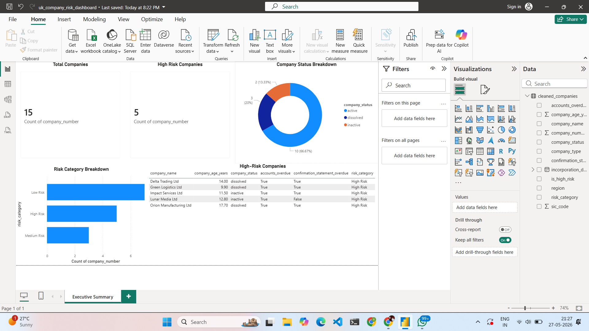

# UK Company Risk Dashboard

## Project Overview

This project analyses UK company records to identify risk indicators, sector patterns and business-health signals using Python, SQL and Power BI.

The goal is to demonstrate how public company data can be cleaned, transformed and visualised into a decision-ready dashboard for finance, banking, operations and risk teams.

## Dashboard Preview

## Key Results

- Analysed 15 UK company records.
- Identified 10 active companies, 3 dissolved companies and 2 inactive companies.
- Classified 5 companies as High Risk based on company status and overdue filing indicators.
- Built a Power BI dashboard showing company status, risk category breakdown and high-risk company details.

## Business Problem

Finance and operations teams often need to quickly understand which companies may require closer review based on company status, filing behaviour, age, sector and other risk indicators.

This project answers:

- Which companies show higher-risk characteristics?
- Which sectors have the highest concentration of inactive or dissolved companies?
- How does company age relate to business status?
- What indicators should be monitored by an analyst?

## Tools Used

- Python
- pandas
- SQL
- Power BI
- Excel
- GitHub

## Planned Workflow

1. Collect public UK company data
2. Clean and standardise the dataset using Python
3. Store transformed data in SQL-style tables
4. Create risk indicators and summary metrics
5. Build a Power BI dashboard
6. Write business insights and recommendations

## Dashboard Pages

1. Executive Summary
2. Company Status Overview
3. Sector Risk Analysis
4. Company Age and Filing Behaviour
5. Recommendations

## Skills Demonstrated

- Data cleaning
- Data transformation
- SQL analysis
- Dashboard design
- KPI reporting
- Business insight generation
- Risk analysis
- Data storytelling

## Final Output

The final project will include:

- Cleaned dataset
- Python cleaning notebook
- SQL queries
- Power BI dashboard screenshots
- Business insight report
- Recommendations for stakeholders
